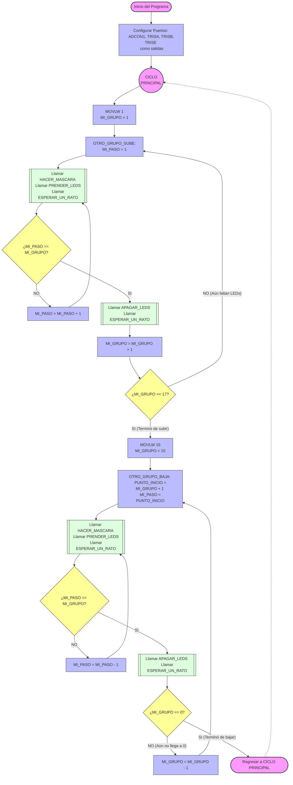

```mermaid
graph TD
    %% Estilos (Definición)
    classDef inicio fill:#f9f,stroke:#333,stroke-width:2px;
    classDef proceso fill:#bbf,stroke:#333,stroke-width:1px;
    classDef subrutina fill:#dfd,stroke:#333,stroke-width:1px;
    classDef decision fill:#ff9,stroke:#333,stroke-width:1px;

    %% INICIO Y CONFIGURACIÓN
    Start([Inicio del Programa]) --> Config[Configurar Puertos: <br> ADCON1, TRISA, TRISB, TRISE <br> como salidas]
    Config --> CicloPrincipal((CICLO <br> PRINCIPAL))

    %% ==========================================
    %% FASE 1: ASCENDENTE
    %% ==========================================
    CicloPrincipal --> InitAsc[MOVLW 1 <br> MI_GRUPO = 1]
    
    InitAsc --> OtroGrupoSube[OTRO_GRUPO_SUBE: <br> MI_PASO = 1]
    
    OtroGrupoSube --> OtroPasoSube[[Llamar HACER_MASCARA <br> Llamar PRENDER_LEDS <br> Llamar ESPERAR_UN_RATO]]
    
    OtroPasoSube --> CondPasoSube{¿MI_PASO == MI_GRUPO?}
    
    CondPasoSube -- "NO" --> IncPaso[MI_PASO = MI_PASO + 1]
    IncPaso --> OtroPasoSube
    
    CondPasoSube -- "SI" --> YaLlegoSube[[Llamar APAGAR_LEDS <br> Llamar ESPERAR_UN_RATO]]
    
    YaLlegoSube --> IncGrupoSube[MI_GRUPO = MI_GRUPO + 1]
    
    IncGrupoSube --> CondGrupoSube{¿MI_GRUPO == 17?}
    
    CondGrupoSube -- "NO (Aún faltan LEDs)" --> OtroGrupoSube

    %% ==========================================
    %% FASE 2: DESCENDENTE
    %% ==========================================
    CondGrupoSube -- "SI (Terminó de subir)" --> InitDesc[MOVLW 15 <br> MI_GRUPO = 15]
    
    InitDesc --> OtroGrupoBaja[OTRO_GRUPO_BAJA: <br> PUNTO_INICIO = MI_GRUPO + 1 <br> MI_PASO = PUNTO_INICIO]
    
    OtroGrupoBaja --> OtroPasoBaja[[Llamar HACER_MASCARA <br> Llamar PRENDER_LEDS <br> Llamar ESPERAR_UN_RATO]]
    
    OtroPasoBaja --> CondPasoBaja{¿MI_PASO == MI_GRUPO?}
    
    CondPasoBaja -- "NO" --> DecPaso[MI_PASO = MI_PASO - 1]
    DecPaso --> OtroPasoBaja
    
    CondPasoBaja -- "SI" --> YaLlegoBaja[[Llamar APAGAR_LEDS <br> Llamar ESPERAR_UN_RATO]]
    
    YaLlegoBaja --> CondGrupoBaja{¿MI_GRUPO == 0?}
    
    CondGrupoBaja -- "NO (Aún no llega a 0)" --> DecGrupoBaja[MI_GRUPO = MI_GRUPO - 1]
    DecGrupoBaja --> OtroGrupoBaja
    
    CondGrupoBaja -- "SI (Terminó de bajar)" --> TerminoTodo([Regresar a CICLO PRINCIPAL])
    TerminoTodo -.-> CicloPrincipal

    %% ==========================================
    %% Asignación de colores (Seguro para GitHub)
    %% ==========================================
    class Start,CicloPrincipal,TerminoTodo inicio;
    class Config,InitAsc,OtroGrupoSube,IncPaso,IncGrupoSube,InitDesc,OtroGrupoBaja,DecPaso,DecGrupoBaja proceso;
    class OtroPasoSube,YaLlegoSube,OtroPasoBaja,YaLlegoBaja subrutina;
    class CondPasoSube,CondGrupoSube,CondPasoBaja,CondGrupoBaja decision;
```
